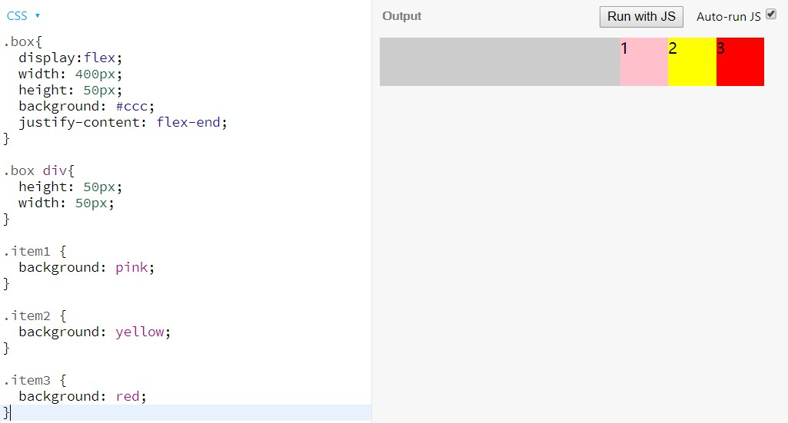
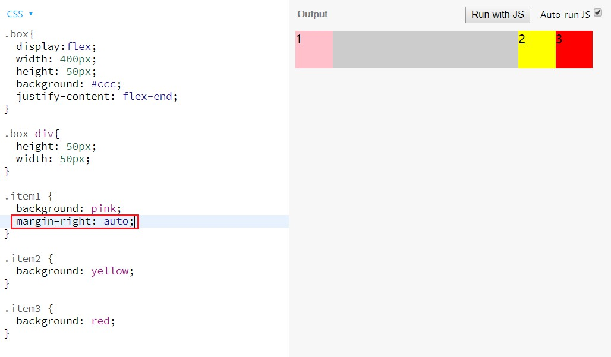

Flex 是 Flexible Box 的缩写，意为"弹性布局"，功能强大，目前网页布局中使用评率极高。但Flex布局涉及的相关属性繁杂，看过阮一峰的《Flex布局教程》之后，将常用属性整理于此，做个备忘参考。
属性用法根据自己理解解释为大白话，便于记忆参考，更深入的解释用法请参考阮文。

## 容器属性
1. display: flex  // 设置flex布局

2. flex-direction //排列方向
   + row 默认值，水平从左到右
   + row-reverse 水平从右到左
   + column 垂直从上到下
   + column-reverse 垂直从下到上

3. flex-wrap // 是否换行
   + nowrap 默认值，不换行
   + wrap 换行
   + wrap-reverse 换行，并且颠倒行顺序

4. flex-flow // `flex-direction` 和 `flex-wrap` 的缩写
  
5. justify-content // 水平对齐方式
   + flex-start 默认值 往左靠
   + flex-end 往右靠
   + center 往中间靠
   + space-between 两端对齐，中键留间隔
   + space-around 两端对齐，两端也留间隔

6. align-items // 垂直对齐方式
   + flex-start 靠上
   + flex-end 靠下
   + center 居中
   + baseline 基线对齐
   + stretch 拉伸
  
7. align-content // 多行垂直对齐方式
   + flex-start 往上堆
   + flex-end 往下堆
   + center 居中
   + space-between 上下端撑满，行间留间隔
   + space-around  上下端也留间隔
   + stretch 每行都拉伸

## 子项属性
1. flex-basis // 子项基准宽或高，默认auto，即由子项内容决定

2. flex-grow: 数字 // 以数字为比例分配容器剩余空间，默认为0，即子项原始大小

3. flex-shrink: 数字 // 数字乘以**该子项的基准宽度**为比例，收缩超过容器宽度的部分。默认值为1。

4. flex // `flex-grow`, `flex-shrink`, `flex-basis` 的缩写
   + 0 1 auto（默认值）
   + auto （1 1 auto）
   + none （0 0 auto）

5. align-self // 某子项与众不同，单独设置纵向排列方式，覆盖容器的align-items属性
   + auto （默认值），继承容器
   + flex-start
   + flex-end
   + center
   + baseline
   + stretch

6. order: 数字 // 数值小的排前面
   
## 其他

Q： 子项`align-self`可以设置单独的**纵轴**对齐方式，但是不存在~~justify-self~~这个属性实现单独的**横轴**对齐，那么怎么办呢？  
A： 可以给子项单独设置`margin`实现子项的横轴对齐

例子： 比如item1想单独靠右，如何实现？
  

解决：单独设置item2的`margin`
  