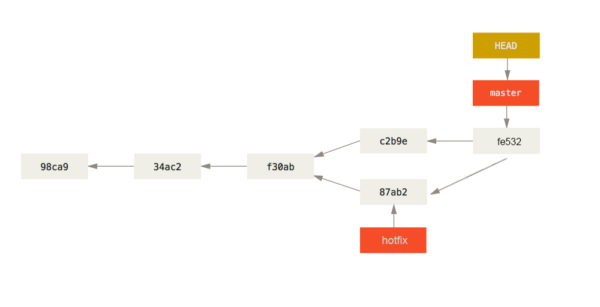

[同时也发布在简书](https://www.jianshu.com/p/46a7a8a6207f)

git是前端常用工具，但对于还在自学中的前端，用的真是不多，导致用的时候忘记命令然后重学一遍。鉴于git原理与入门遍地都是，这里我总结一下常用命令和遇到过的问题，做个备忘参考。  

**此文章比较适合学过git但是经常忘记的小伙伴们作为备忘参考！**

用到新的命令或者遇到新的问题时我会更新。若有疏漏，敬请指正。

[git官方文档](https://git-scm.com/docs)

## Part.A 常用命令

### 一、 基础命令

    # 初始化
     git init

    # 克隆仓库(当然第一次克隆要先生成添加ssh key)，只获取master分支
     git clone git@github.com:username/repo.git <文件夹名(可省略)>

    # 克隆仓库并重命名为myrepo
     git clone git@github.com:username/repo.git myrepo

    # 查看状态
     git status

    # 简短查看状态，-s 指简洁查看，-b 显示branch
     git status -sb

    # 添加到暂存区(stage和index都是指暂存区)
     git add .

    # 添加到commited，-m 指message
     git commit -m "内容"

    # 查看commit历史，每次commit会产生一个commit id
     git log

    # 推送当前改动到远程库(origin)的master分支
     git push origin master 

### 二、进阶命令
#### 地址标签命令
    # 查看本地库里记录的远程库地址
     git remote -v

    # 这里把远程库的地址加个标签，叫origin
    # origin其实就是这个远程库的标签(别名)
    # 常用于github新建空白仓库后，把本地仓库传上去
     git remote add origin git@github.com:username/repo.git

    # 再添加一个叫 gitlab 的远程库
     git remote add gitlab git@gitlab.com:username/repo.git

    # 推送到 gitlab 标签的地址上
     git push gitlab master
     
    # 删除 gitlab 标签
     git remote remove gitlab
     
    # 修改 origin 标签对应的地址
     git remote set-url origin git@github.com:username/repo2.git
     
    # 把 gitlab 标签改名为coding
     git remote rename gitlab coding

#### 分支命令
    # 创建本地库hotfix分支
     git branch hotfix
     
    # 切换到hotfix分支，进行修改
     git checkout hotfix

    # 切换到master分支，继续master分支的开发
     git checkout master

    # 推送到origin地址的hotfix分支上
     git push origin hotfix

    # 把hotfix分支的内容合并到当前分支(master)
     git merge hotfix

    # 删除分支 -d 删除分支，-D 强制删除
     git branch -d <branch> 

     

   
> 上图中从左往右开发，HEAD指的是当前分支。图中在master分支的第三次提交(f30ab)上创建了一个hotfix分支，进行了修改。而master继续开发。之后将hotfix分支merge到master，产生了fe532。

### 三、常用的其他命令和衍生用法(待补充)
    # 相当于 git add -u 加上 git commit -m "内容"
    # 有些文章写的 "相当于git add . 加上 git commit -m" 是错的！！！
    # 只能更新和删除，不能添加新文件！！
     git commit -am "内容"

    # 基本等同于 git fetch 加上 git merge，获取后合并到指定的本地分支
    # 与git fetch 的区别详见Q&A
     git pull <remote> <远程branch>:<本地branch>

    # 一般远程分支和本地分支同名，后面不用写
     git pull <remote> <远程branch>

    # 如果只有一个<remote>只有一个<branch>，后面不写也行
     git pull

    # 相当于git branch xxx 加上 git checkout xxx
     git checkout -b xxx

    # 只克隆最近一次提交，也可以指定次数
     git clone git@github.com:username/repo.git --depth=1

## Part.B Q&A

### Q1. `git add -A` 、 `git add .` 、 `git add -u` 区别

网上有些文章还是git老版本，和新版本有区别。

**Git Version 1.x**  

**Git Version 2.x**

`git add -A` 等同于 `git add --all`  
`git add -u` 等同于 `git add --update`  
`git add -a`是错误写法，会报错

### Q2. `git add *` 与 `git add .`区别？

关于这个问题基本搜不到相关文章，后来在stackoverflow上找到了一些解答，试着总结一下。以下情况我在git 2.18.0.windows.1中测试确认过。
1. `*` 是shell提供的通配符，`git add *.html` 会匹配所有html文件，这是当通配符的用法
2. `git add *` 一般不匹配以.开头的文件(例如.gitignore)，而 `git add .` 会匹配所有
3. 当文件夹中有且只有以 `.` 开头的文件时，`git add * `会匹配以 `.` 开头这样的文件
4. .gitignore中有非 `.` 开头的文件时，用 `git add *` 会有提示"The following paths are ignored by one of your .gitignore files:"，而 `git add . `不会有这样提示，但是两者的效果是一样的(除了 `git add *` 不会匹配 `.` 开头的文件)

**总之，知道前两点就可以了。**

### Q3. warning: LF will be replaced by CRLF 问题？

[关于git提示“warning: LF will be replaced by CRLF”终极解答](https://www.jianshu.com/p/450cd21b36a4)  
Dos和Windows平台： 使用回车(CR)和换行(LF)两个字符来结束一行，回车+换行(CR+LF)，即“\r\n”；
Mac 和 Linux平台：只使用换行(LF)一个字符来结束一行，即“\n”；
所以有个转换的问题，git安装的时候就有相关选项，安装完也可以输入命令设置。  

**知道有这个事儿就行了，出问题再说吧。**  

### Q4. `git fetch` 和 `git pull`的区别和使用？
#### `git fetch` 命令：  

    # 这个命令将某个远程主机的更新全部取回本地
    # 如果没写<remote>则获取所有<remote>的更新
     git fetch <remote>

    # 如果只想取回特定分支的更新，可以指定分支名
     git fetch <remote> <branch>

    # 查看FETCH_HEAD，里面有远程仓库的更改记录
    # 而git log中只有当前本地的！
     git log -p FETCH_HEAD

#### `git fetch` 获取更新的方法：

    # 在本地新建一个temp分支，并将远程仓库的代码下载到temp分支中
    git fetch origin master:temp

    # 比较本地代码与temp分支中代码的区别
    # 下列几条命令都可以查看区别，但略有不同，按需使用
    git diff temp
    git diff master..temp
    git diff master ^temp
    git log -p master..temp
    
    # 合并temp分支到当前本地分支
    git merge temp
  
    # 删除合并完没用的temp分支
    git branch -d temp
  
而`git pull`可以认为是`git fetch`和`git merge`两个步骤的结合。  
如果本地没有做过改动，则可以直接`git pull`更新到远程仓库的最新代码，更方便！  
如果本地有过改动，使用`git pull`命令后会有冲突，不过没关系，根据bash的提示进行操作即可。

### Q5. `git reset(--soft --hard)` 和 `git revert` 的区别?
首先要知道git有三个区工作区(working directroy)、暂存区(index)、版本库(commit history)，这属于git基本原理，不作赘述。

#### `git reset`  命令
等同于`git reset --mixed`, --mixed 是 reset 的默认参数。  
作用是重置暂存区，即取消之前的add，工作区的修改仍然保留。

#### `git reset --soft xxx` 命令
作用是回到某次commit，但是暂存区和工作区做过的修改仍然保留。

    # 回到上次commit之前，HEAD~1 指的是HEAD指针往前一格
    # 比如你commit注释写错了或者commit错了，回到上次就用这个
     git reset --soft HEAD~1

    # 根据commit id，回到某次commit之后
     git reset --hard 03dd660

#### `git reset --hard xxx` 命令
作用是回到某次commit，并且重置暂存区和工作区。   
例如发现修改了不该改的分支，可以在老板发现前读档。做过的修改就当做没有发生，`git log`中也不会显示，但是`git reflog` 命令还是能看到，并且还能再reset回去。

    # 回到上上次commit之前，HEAD~1 指的是HEAD指针往前两格
     git reset --hard HEAD~2
    # 根据commit id，回到某次commit之后
     git reset --hard 03dd660

#### `git revert` 命令
作用是复制以前的commit作为最新的commit，不会重置工作区，暂存区有改动时无法revert

    # 回到上次commit之前(即上上次之后），并作为新的内容commit
     git revert HEAD
    # 回到上上次commit之前，注意这边计数也和reset不同
     git revert HEAD~1

区别在于，reset会把恢复点后面的commit删掉，当前分支上的commit减少；
而revert会复制指定的某次commit到当前分支，分支上的commit数变多！